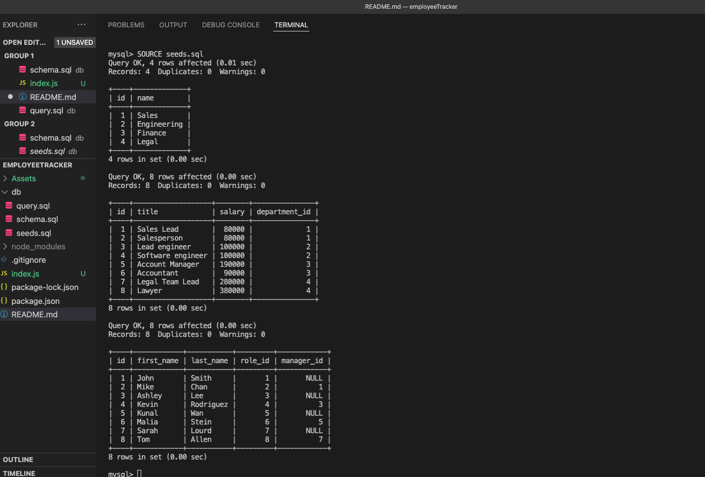

# employeeTracker

## Table of Contents

- [walkthrough video](#walkthrough-video)
- [Descripttion](#descripttion)
- [Installation](#installation)
- [Mock-Up](#mock-up)
- [Questions](#questions)

---

## walkthrough video

[walkthrough video ](https://watch.screencastify.com/v/PNvavS7FV2XilAiQ4GuT)  

---

## Descripttion

The business owners WANT to be able to view and manage the departments, roles, and employees in company
SO THAT the business owners can organize and plan business

Given a command-line application that accepts user input
WHEN the business owners start the application
THEN the business owners are presented with the following options: view all departments, view all roles, view all employees, add a department, add a role, add an employee, and update an employee role

WHEN the business owners choose to view all departments
THEN the business owners are presented with a formatted table showing department names and department ids

WHEN the business owners choose to view all roles
THEN the business owners are presented with the job title, role id, the department that role belongs to, and the salary for that role

WHEN the business owners choose to view all employees
THEN the business owners are presented with a formatted table showing employee data, including employee ids, first names, last names, job titles, departments, salaries, and managers that the employees report to

WHEN the business owners choose to add a department
THEN the business owners are prompted to enter the name of the department and that department is added to the database

WHEN the business owners choose to add a role
THEN the business owners are prompted to enter the name, salary, and department for the role and that role is added to the database

WHEN the business owners choose to add an employee
THEN the business owners are prompted to enter the employee’s first name, last name, role, and manager, and that employee is added to the database

WHEN the business owners choose to update an employee role
THEN the business owners am prompted to select an employee to update and their new role and this information is updated in the database

---

## Installation

    * Uses the [Inquirer package](https://www.npmjs.com/package/inquirer).

    * Uses the [MySQL2 package](https://www.npmjs.com/package/mysql2) to connect to a MySQL database.

    * Uses the [console.table package](https://www.npmjs.com/package/console.table) to print MySQL rows to the console.

node index.js

---

## Mock-Up

The following image shows a mock-up of the generated HTML’s appearance and functionality:

---

## Questions

Feel free to reach out via Github or email with any questions.  
[Github](https://github.com/kayjinyi)  
[email](mailto:kayjinyi@gmail.com)

---
